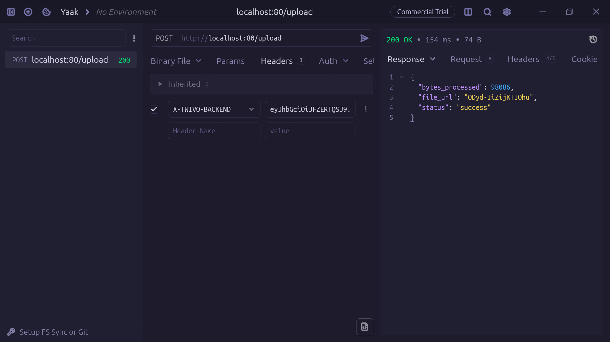
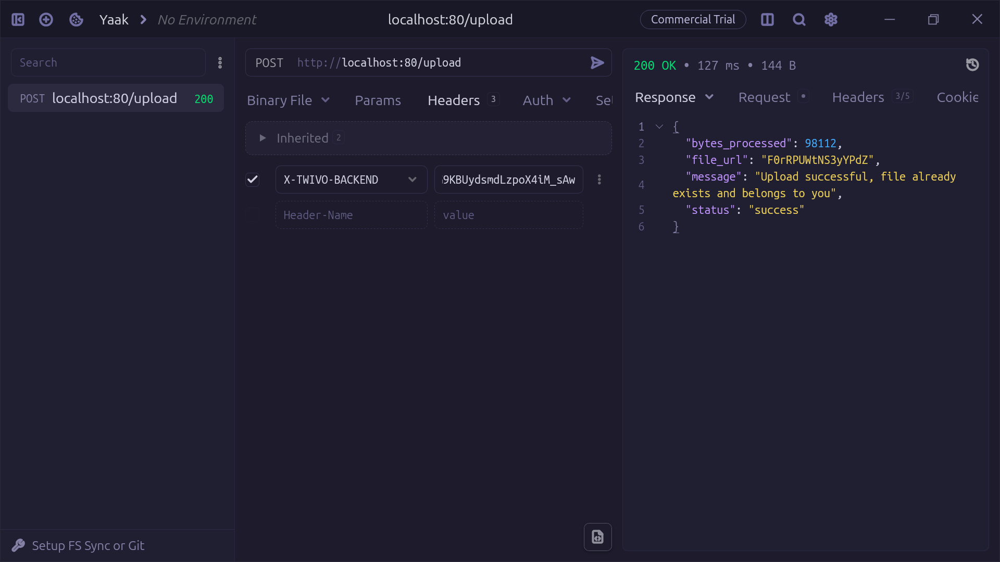
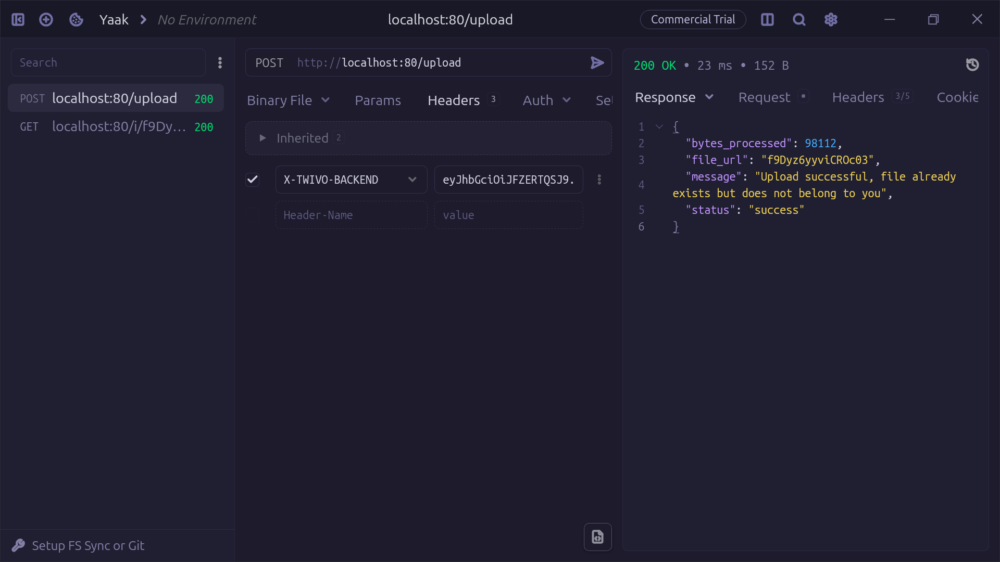
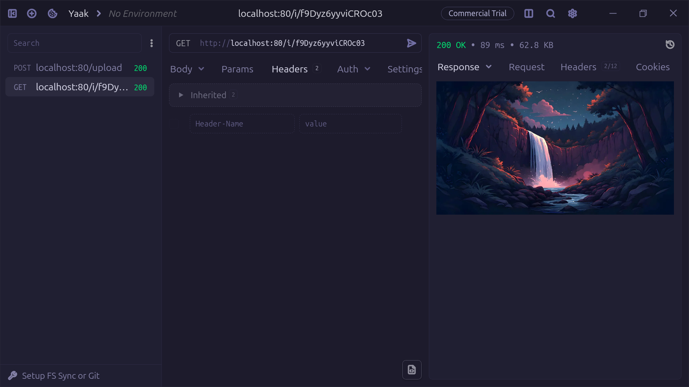

#  Twivo Media

[](https://go.dev/)
[](https://seaweedfs.com/)
[](https://imgproxy.net/)
[](https://www.docker.com/)
[](https://nginx.org/)
[](https://deepwiki.com/husseinayyed/twivo-media)

[](https://golang.org)


Twivo Media is a Go image service for Twivo. It validates and streams image uploads to SeaweedFS, uses Redis and Asynq for duplicate detection and asynchronous metadata processing, and delivers resized WebP images through imgproxy.

## At A Glance

| Capability | Current behavior |
| --- | --- |
| Uploads | JPEG, PNG, and WebP; streamed to SeaweedFS |
| Validation | `100x100` to `2048x2048`, with a 20 MiB edge limit |
| Authentication | Ed25519 JWT with issuer, audience, and one-time JTI checks |
| Metadata | Redis hash records created by an embedded Asynq worker |
| Delivery | imgproxy transforms originals into WebP |
| Caching | Nginx response cache, process-local LRU, then Redis |

## Architecture

```text
Client
  |
  v
Nginx :80
  |
  v
Gin API :8020
  |----------------------> SeaweedFS Filer :8888
  |                         original image bytes
  |
  +--> Redis :6379 <------ Asynq worker
  |      metadata and cache
  |
  +--> imgproxy :8080 ----> SeaweedFS Filer
       resize and WebP output
```

Nginx is only the public reverse proxy, cache, rate limiter, and user-agent filter. JWT validation is performed by the Go API.

Nginx caches successful image responses for `10m` and image `404` responses for `1m`. The shorter negative-cache window limits stale misses while the asynchronous worker is still writing metadata.

## Features

- JPEG, PNG, and WebP signature validation.
- Image dimensions from `100x100` through `2048x2048`.
- Streaming uploads with a 20 MiB Nginx body limit.
- SHA-256 checksum detection for exact duplicate uploads.
- Ed25519 JWT verification with issuer, audience, and JTI replay protection.
- Redis-backed Asynq upload tasks.
- SeaweedFS storage with imgproxy WebP delivery.
- LRU and Redis metadata lookup layers.
- Nginx response caching, upload/image rate limits, and Nmap blocking.

## Upload Workflows

The screenshots below show the intended request flow and duplicate-handling behavior.

### 1. Successful new upload

A new file is streamed to SeaweedFS, a checksum record is created, and an Asynq task stores metadata for the new NanoID.



### 2. Same file and same user

The checksum matches an existing upload owned by the current user. The newly uploaded duplicate is removed from SeaweedFS, and the existing file identity is reused.



```text
new upload -> checksum match -> same owner
                    |
                    +-> delete new SeaweedFS object
                    +-> reuse original file identity
```

### 3. Same file and a different user

The checksum matches an existing file owned by another user. The newly uploaded duplicate is removed from SeaweedFS, while a new NanoID mapping is created for the requesting user and points to the original stored file.



```text
new upload -> checksum match -> different owner
                    |
                    +-> delete new SeaweedFS object
                    +-> create new NanoID metadata
                    +-> point new NanoID to original object
```

### 4. Image retrieval and cache layers

The image route checks metadata in this order:

1. **LRU cache:** fastest, process-local metadata lookup.
2. **Redis:** shared `nano:<id>` metadata fallback.
3. **MongoDB:** planned persistent fallback; not implemented in the current repository.
4. **SeaweedFS through imgproxy:** reads the original object and returns resized WebP bytes.



```text
GET /i/:id
    |
    +-> LRU hit ------------------------------> imgproxy -> SeaweedFS
    |
    +-> LRU miss -> Redis hit ----------------> imgproxy -> SeaweedFS
    |
    +-> Redis miss -> MongoDB (planned) ------> imgproxy -> SeaweedFS
    |
    +-> no metadata --------------------------> 404
```

## Technology Stack

| Layer | Technology |
| --- | --- |
| Language | Go 1.26.5 |
| HTTP API | Gin |
| Authentication | JWT v5 and Ed25519 |
| Queue | Asynq |
| Shared metadata | Redis 7 |
| Object storage | SeaweedFS |
| Image transformation | imgproxy |
| Public proxy/cache | Nginx |
| Local orchestration | Docker Compose |

## Configuration

Create `.env` in the project root:

```dotenv
REDIS_URL=redis:6379
IMGPROXY_URL=http://imgproxy:8080
WEED_FILER_URL=http://weed-filer:8888
JWT_ISS=twivo
JWT_AUD=media
PUBLIC_KEY_PATH=/app/keys/public.pem
```

| Variable | Required | Description |
| --- | --- | --- |
| `REDIS_URL` | Yes | Redis and Asynq address |
| `IMGPROXY_URL` | Yes | imgproxy base URL |
| `WEED_FILER_URL` | Yes | SeaweedFS Filer URL |
| `JWT_ISS` | Yes | Expected JWT issuer |
| `JWT_AUD` | Yes | Expected JWT audience |
| `PUBLIC_KEY_PATH` | Yes | Ed25519 public-key PEM path |

The API reads the JWT issuer, audience, and Ed25519 public-key path from these environment variables and fails during startup if they are empty.

### Generate Ed25519 Keys

From the repository root, generate the private key locally and derive the public key used by the API:

```bash
./scripts/generate_keys.sh
```

The script creates:

- `keys/private.pem` for signing JWTs.
- `keys/public.pem` for API verification through `PUBLIC_KEY_PATH`.

The script checks that OpenSSL is installed, asks for confirmation before overwriting existing keys, and adds `keys/` to `.gitignore` automatically. Keep `keys/private.pem` on the trusted token-signing system and never expose it. The public key is safe to share and is required by the API. Use the private key when signing tokens for `X-TWIVO-BACKEND`.

## Run Locally

Start the Compose infrastructure:

```bash
docker compose up -d --build
```

The development image uses an idle command. Start the API and embedded Asynq worker in the `twivo-media` container:

```bash
docker compose exec twivo-media go run .
```

The public service is available at `http://localhost`.

```bash
# Stop services
docker compose down

# Stop services and remove SeaweedFS volumes
docker compose down -v

# Run tests
go test ./...
```

## API

### `POST /upload`

Send the image as the raw request body with a one-time Ed25519 JWT:

```bash
curl -X POST http://localhost/upload \
  -H "X-TWIVO-BACKEND: <signed-jwt>" \
  -H "Content-Type: image/jpeg" \
  --data-binary @image.jpg
```

The JWT must contain:

| Claim | Required value |
| --- | --- |
| `iss` | `twivo` |
| `aud` | `media` |
| `sub` | user ID |
| `id` | tweet ID |
| `jti` | unique token ID |

A successful response includes a NanoID:

```json
{
  "status": "success",
  "file_url": "NswCLWJlKhlZIAm0",
  "bytes_processed": 184203
}
```

### `GET /i/:id`

```bash
curl -o image.webp http://localhost/i/NswCLWJlKhlZIAm0
```

The API resolves metadata and asks imgproxy to fetch `/buckets/twivo/<original-id><extension>` from SeaweedFS, resize it, and encode it as WebP.

### `GET /ping`

The health route is registered in Gin but is not publicly proxied by the current Nginx configuration. Query it inside the app container:

```bash
docker compose exec twivo-media wget -qO- http://127.0.0.1:8020/ping
```

## Service Ports

| Service | Port | Role |
| --- | ---: | --- |
| Nginx | `80` | Public gateway |
| Twivo API | `8020` | Gin server |
| Redis | `6379` | Metadata and queue backend |
| SeaweedFS master | `9333` | Cluster coordination |
| SeaweedFS volume | `8085` | Volume storage |
| SeaweedFS Filer | `8888` | File API |
| imgproxy | `8080` | Resize and WebP output |

## Project Structure

```text
.
├── internal/cache/              # LRU caches
├── internal/database/redis/     # Redis connection
├── internal/handler/            # Upload and image routes
├── internal/middleware/         # JWT verification
├── internal/storage/            # SeaweedFS upload and cleanup
├── internal/tasks/              # Asynq payloads and enqueueing
├── internal/utils/              # File type, dimensions, checksum logic
├── internal/worker/             # Embedded Asynq worker
├── docs/screenshots/            # Upload and cache screenshots supplied later
├── docker-compose.yaml
├── Dockerfile
├── nginx.conf
└── main.go
```

## Troubleshooting

If an upload returns successfully but `GET /i/:id` returns `404`, check that the API log contains `Starting processing` and `Scheduled upload task`. The worker must be running and connected to the same Redis instance. Nginx caches image `404` responses for only 10 minutes, so wait for the worker and retry after the negative-cache window expires.

## License

This project is licensed under the GNU Affero General Public License v3.0 (AGPLv3).
