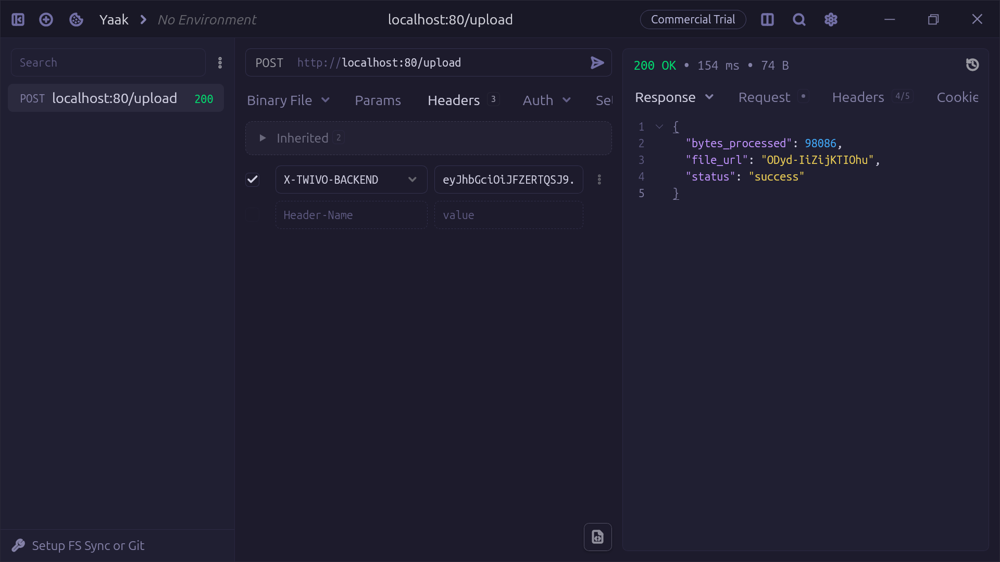
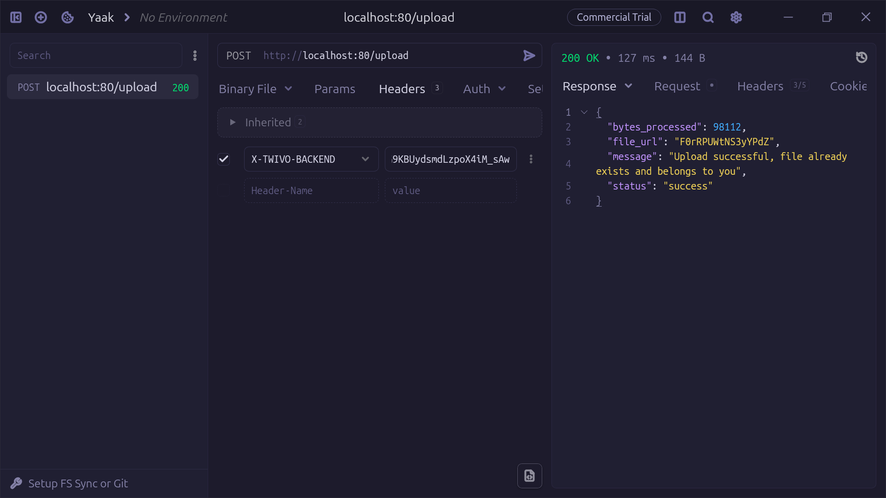
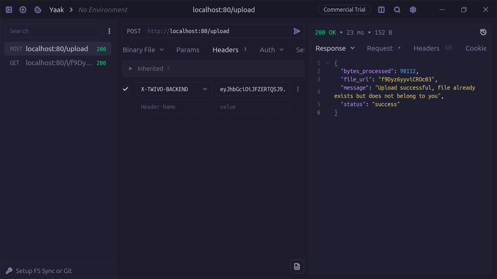
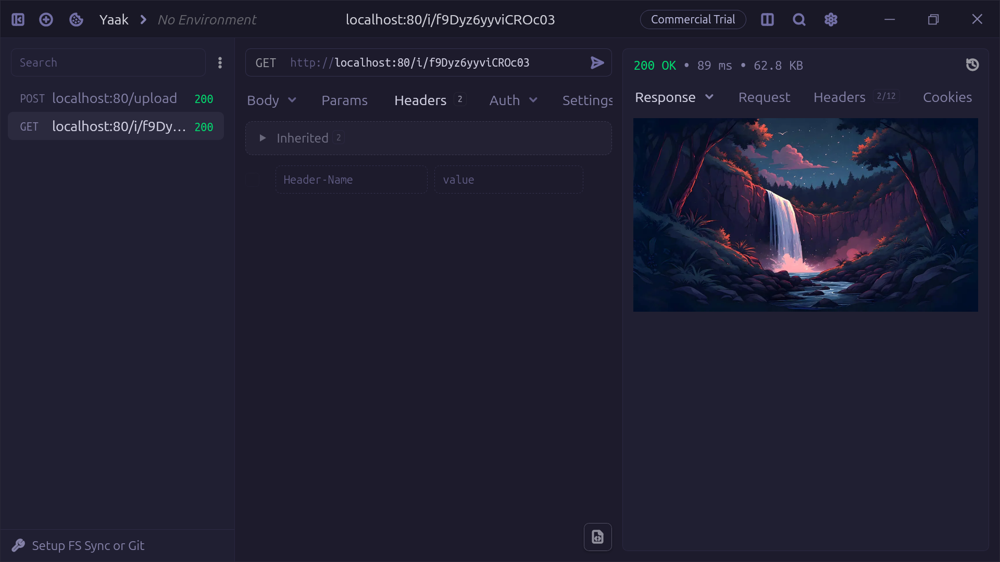

#  Twivo Media

[](https://go.dev/)
[](https://seaweedfs.com/)
[](https://imgproxy.net/)
[](https://www.docker.com/)
[](https://nginx.org/)
[](https://deepwiki.com/husseinayyed/twivo-media)

[](https://golang.org)


Twivo Media is a Go image service for Twivo. It validates and streams image uploads to SeaweedFS, uses Redis and Asynq for duplicate detection and asynchronous metadata processing, and delivers resized WebP images through imgproxy.

## Contents

- [At a glance](#at-a-glance)
- [Requirements](#requirements)
- [Architecture](#architecture)
- [Features](#features)
- [Upload workflows](#upload-workflows)
- [Configuration](#configuration)
- [Development and testing](#run-locally)
- [Production and backups](#production-and-data-backups)
- [API](#api)
- [Troubleshooting](#troubleshooting)

## Requirements

- Docker Engine and Docker Compose v2
- GNU Make
- Go to run the Ed25519 key generator and the API locally

## At A Glance

| Capability | Current behavior |
| --- | --- |
| Uploads | JPEG, PNG, and WebP; streamed to SeaweedFS |
| Validation | `100x100` to `2048x2048`, with a 20 MiB edge limit |
| Authentication | Ed25519 JWT with issuer, audience, and one-time JTI checks |
| Metadata | Redis hash records and MongoDB image documents created by an embedded Asynq worker |
| Delivery | imgproxy transforms originals into WebP |
| Caching | Nginx response cache, process-local LRU, then Redis |
| Resilience | Circuit breakers protect MongoDB, Redis setup, SeaweedFS transfers, and imgproxy requests |

## Architecture

```text
Client
  |
  v
Nginx :80
  |
  v
Gin API :8020
  |----------------------> SeaweedFS Filer :8888
  |                         original image bytes
  |
  +--> Redis :6379 <------ Asynq worker
  |      metadata and cache
  |
  +--> MongoDB :27017 <--- Asynq worker
  |      durable image metadata
  |
  +--> imgproxy :8080 ----> SeaweedFS Filer
       resize and WebP output
```

Uploads are streamed from the API to the SeaweedFS Filer. Image retrieval first resolves metadata through the cache and database layers, then the API reverse-proxies the request to imgproxy, which reads the original from SeaweedFS and returns WebP output.

Nginx is only the public reverse proxy, cache, rate limiter, and user-agent filter. JWT validation is performed by the Go API.

Circuit breakers protect MongoDB operations, Redis connection setup, SeaweedFS uploads and cleanup, and requests to imgproxy. The imgproxy breaker wraps the reverse proxy's HTTP transport, counts transport errors and upstream `5xx` responses as failures, and opens after four consecutive failures. It permits retries after a 15-second recovery timeout.

Redis uses append-only persistence in the base/development Compose configuration and stores its data in named Docker volumes in development and production. The test Compose overlay uses temporary mounts for service data, which are discarded when the test containers are removed. Nginx caches successful image responses and image `404` responses for `10m`. A cached `404` can remain until that negative-cache window expires if the asynchronous worker has not finished writing metadata.

## Features

- JPEG, PNG, and WebP signature validation.
- Image dimensions from `100x100` through `2048x2048`.
- Streaming uploads with a 20 MiB Nginx body limit.
- SHA-256 checksum detection for exact duplicate uploads.
- Ed25519 JWT verification with issuer, audience, and JTI replay protection.
- Redis-backed Asynq upload tasks.
- SeaweedFS storage with imgproxy WebP delivery.
- MongoDB persistence for image metadata with startup index creation.
- Redis persistence via a dedicated Docker volume.
- LRU and Redis metadata lookup layers.
- LRU and Redis metadata lookup layers.
- Circuit breakers for MongoDB, Redis connection setup, SeaweedFS upload/cleanup, and imgproxy requests.
- Nginx response caching, upload/image rate limits, and Nmap blocking.

### Nginx Request Controls

Limits are applied per client IP. A request whose user agent matches `Nmap` is closed with Nginx's non-standard `444` response.

| Route | Rate | Burst |
| --- | ---: | ---: |
| `POST /upload` | 5 requests/minute | 2 |
| `GET /i/:id` | 3 requests/second | 5 |
| Other paths | 5 requests/minute | 5 |

The upload request body is limited to `20 MiB`.

## Upload Workflows

The screenshots below show the intended request flow and duplicate-handling behavior.

### 1. Successful new upload

A new file is streamed to SeaweedFS, a checksum record is created, and an Asynq task stores metadata for the new NanoID.



### 2. Same file and same user

The checksum matches an existing upload owned by the current user. The newly uploaded duplicate is removed from SeaweedFS, and the existing file identity is reused.



```text
new upload -> checksum match -> same owner
                    |
                    +-> delete new SeaweedFS object
                    +-> reuse original file identity
```

### 3. Same file and a different user

The checksum matches an existing file owned by another user. The newly uploaded duplicate is removed from SeaweedFS, while a new NanoID mapping is created for the requesting user and points to the original stored file.



```text
new upload -> checksum match -> different owner
                    |
                    +-> delete new SeaweedFS object
                    +-> create new NanoID metadata
                    +-> point new NanoID to original object
```

### 4. Image retrieval and cache layers

The image route checks metadata in this order:

1. **LRU cache:** fastest, process-local metadata lookup.
2. **Redis:** shared `nano:<id>` metadata fallback.
3. **MongoDB:** durable metadata lookup when Redis does not have the record.
4. **SeaweedFS through imgproxy:** reads the original object and returns resized WebP bytes.

MongoDB stores durable image metadata and is written by the upload worker. Successful MongoDB lookups hydrate the LRU and Redis caches so the next request can serve the image without another database round trip.



```text
GET /i/:id
    |
    +-> LRU hit ------------------------------> imgproxy -> SeaweedFS
    |
    +-> LRU miss -> Redis hit ----------------> imgproxy -> SeaweedFS
    |
    +-> Redis miss -> MongoDB hit ------------> cache + imgproxy -> SeaweedFS
    |
    +-> no metadata --------------------------> 404
```

> The image route now performs a `nano_id` lookup against MongoDB and exits immediately on `ErrNoDocuments` to avoid nil dereferences and incorrect 404 fallthroughs.

## Technology Stack

| Layer | Technology |
| --- | --- |
| Language | Go 1.26.5 |
| HTTP API | Gin |
| Authentication | JWT v5 and Ed25519 |
| Queue | Asynq |
| Shared metadata | Redis 7 with persistent Docker volume |
| Object storage | SeaweedFS |
| Image transformation | imgproxy |
| Resilience | gobreaker circuit breakers |
| Public proxy/cache | Nginx |
| Local orchestration | Docker Compose |

## Configuration

Create `.env` from the example file in the project root, then replace the placeholder values, including `PUBLIC_KEY`:

```bash
cp .env.example .env
```

The example contains:

```dotenv
APP_STAGE=dev
REDIS_PASS=<redis-password>
REDIS_URL=redis://:<redis-password>@redis:6379/0
MONGODB_URL=mongodb://mongodb:27017
MONGODB_USER=twivo
MONGODB_PASSWORD=<password>
IMGPROXY_URL=http://imgproxy:8080
WEED_FILER_URL=http://weed-filer:8888
JWT_ISS=twivo
JWT_AUD=media
PUBLIC_KEY=<hex-encoded-32-byte-ed25519-public-key>
GIN_MODE=debug
```

| Variable | Required | Description |
| --- | --- | --- |
| `APP_STAGE` | Yes | Docker build stage; use `dev` locally and `prod` for the production runtime image |
| `REDIS_PASS` | Yes | Redis container password, matching the `requirepass` setting |
| `REDIS_URL` | Yes | Redis URL used by Go, including the password in `redis://:password@host:port/0` format |
| `MONGODB_URL` | Yes | MongoDB address |
| `MONGODB_USER` | Yes | MongoDB username |
| `MONGODB_PASSWORD` | Yes | MongoDB password |
| `IMGPROXY_URL` | Yes | imgproxy base URL |
| `WEED_FILER_URL` | Yes | SeaweedFS Filer URL |
| `JWT_ISS` | Yes | Expected JWT issuer |
| `JWT_AUD` | Yes | Expected JWT audience |
| `PUBLIC_KEY` | Yes | Ed25519 public key as a hex-encoded 32-byte raw key (64 hex characters) |
| `GIN_MODE` | No | Gin runtime mode, typically `debug`, `release`, or `test` |

The app container reads these settings from `.env`. The API requires the JWT issuer, audience, and public key at startup. Set `PUBLIC_KEY` to the generator's **Public Key** output, without the label. Before a production build, set `APP_STAGE=prod` in `.env`.

Replace example passwords with strong values and keep `.env` and the private key out of version control.

MongoDB image metadata is stored in the `twivo.images` collection. Startup creates indexes for `nano_id`, `check_sum`, and `phash`.

### Generate Ed25519 Keys

From the repository root, generate an Ed25519 key pair:

```bash
go run ./cmd/make-keys
```

The command prints both keys as hex strings. Copy the **Public Key** value into `PUBLIC_KEY` in `.env`; it is the 32-byte Ed25519 public key encoded as 64 hex characters. Keep the **Private Key** value secret and use it only on the trusted system that signs JWTs for `X-TWIVO-BACKEND`. The generator prints the private key to the terminal and does not save either key to disk, so store the private key securely before closing the output.

## Run Locally

Start the development containers with the development Compose file:

```bash
make dev
```

To build and start the development stack separately, use `make dev-build` followed by `make dev-up`.

The development image stays idle so it does not start the API automatically. Open a shell in the media container:

```bash
make dev-shell
```

Start the API and embedded Asynq worker from that shell:

```bash
go run .
```

The public service is available at `http://localhost`.

```bash
# Stop development services
make dev-down

# Stop services and remove development volumes
make dev-clean
```

### Run Tests

The test Compose configuration uses temporary mounts for MongoDB, Redis, SeaweedFS, and the Nginx cache. Start the test stack and open a shell in the app container:

```bash
make test-run
```

Then run the Go tests from the shell:

```bash
go test ./...
```

The test image can also be built and started separately with `make test-build` and `make test-up`. Use `make test-down` to stop the stack, or `make test-clean` to remove the containers and any remaining volumes. Running tests inside the container loads the project's `.env`; a plain host-side `go test ./...` does not automatically load `.env`.

## Production and Data Backups

Set `APP_STAGE=prod` in `.env` before building the production image, then build and start production:

```bash
make prod-build
make prod-up
```

Use `make prod` to build and start in one step. Alternatively, `make prod-build` and `make prod-up` keep those steps separate.

Create a timestamped backup of the MongoDB, Redis, and SeaweedFS data volumes:

```bash
make prod-save
```

This command stops the production stack, writes timestamped MongoDB, Redis, and SeaweedFS volume archives under `backups/production/`, and leaves the stack stopped. Restart it with `make prod-up`. Keep a copy of the archives in secure off-host storage. Use `make prod-down` when stopping production without deleting its persistent volumes. **Do not run `make prod-clean` unless you intend to permanently remove those volumes and their data.**

### View Logs

Docker Compose keeps container logs with bounded rotation: each container keeps up to five `10 MiB` JSON log files. Follow logs from the repository root:

```bash
# Follow logs from every service
make logs

# Follow only Nginx or the Go app logs
make logs-nginx
make logs-app

# Save a timestamped snapshot under logs/
make logs-save
make logs-save-nginx
make logs-save-app
```

Nginx writes structured access logs to the container output, including the method, path, status, client IP, upstream status, request duration, and `request_id`. The Go API and worker use structured zerolog output. The same `X-Request-ID` is forwarded to the API and returned in responses, making it possible to correlate a client request across Nginx and the application logs.

## API

### `POST /upload`

Send the image as the raw request body with a one-time Ed25519 JWT:

```bash
curl -X POST http://localhost/upload \
  -H "X-TWIVO-BACKEND: <signed-jwt>" \
  -H "Content-Type: image/jpeg" \
  --data-binary @image.jpg
```

The API validates the JWT in `X-TWIVO-BACKEND`. It must contain:

| Claim | Required value |
| --- | --- |
| `iss` | `twivo` |
| `aud` | `media` |
| `sub` | user ID |
| `id` | tweet ID |
| `jti` | unique token ID |

The middleware parses the JWT into typed claims: the user ID comes from `sub`, and the tweet/image ID comes from `id`. It validates the issuer and audience, and callers do not need to send separate user/tweet headers. Each upload requires a fresh, unique `jti`.

The service checks the file signature (rather than trusting `Content-Type`), accepts JPEG, PNG, and WebP images, requires dimensions from `100x100` to `2048x2048`, and limits the request body to `20 MiB`.

A successful response includes a NanoID:

```json
{
  "status": "success",
  "file_url": "19ABCDEF012AbCdEf12",
  "bytes_processed": 184203
}
```

### `GET /i/:id`

```bash
curl -o image.webp http://localhost/i/19ABCDEF012AbCdEf12
```

The API resolves metadata and asks imgproxy to fetch `/buckets/twivo/<original-id><extension>` from SeaweedFS, resize it, and encode it as WebP.

### `GET /ping`

The health route is registered in Gin but is not publicly proxied by the current Nginx configuration. Query it inside the app container:

```bash
docker compose exec twivo-media wget -qO- http://127.0.0.1:8020/ping
```

## Service Ports

| Service | Port | Role |
| --- | ---: | --- |
| Nginx | `80` | Public gateway |
| Twivo API | `8020` | Gin server |
| MongoDB | `27017` | Image metadata database |
| Redis | `6379` | Metadata and queue backend |
| SeaweedFS master | `9333` | Cluster coordination |
| SeaweedFS volume | `8085` | Volume storage |
| SeaweedFS Filer | `8888` | File API |
| imgproxy | `8080` | Resize and WebP output |

Only Nginx publishes a host port. The other services communicate over the private Docker network.

## Project Structure

```text
.
├── internal/cache/              # LRU caches
├── internal/database/redis/     # Redis connection
├── internal/handler/            # Upload and image routes
├── internal/middleware/         # JWT verification
├── internal/storage/            # SeaweedFS upload and cleanup
├── internal/tasks/              # Asynq payloads and enqueueing
├── internal/utils/              # File type, dimensions, checksum logic
├── internal/worker/             # Embedded Asynq worker
├── cmd/make-keys/               # Ed25519 key-pair generator
├── docs/screenshots/            # Upload and cache workflow screenshots
├── docker-compose.yaml
├── Dockerfile
├── nginx.conf
└── main.go
```

## Troubleshooting

If an upload returns successfully but `GET /i/:id` returns `404`, check that the API log contains `Scheduled upload task` and that the worker is connected to the same Redis instance. The worker writes Redis metadata asynchronously, so a request can miss before processing completes. Nginx caches image `404` responses for up to 10 minutes; purge the Nginx cache or retry after that window expires.

If host-side `go test ./...` exits during package initialization with a missing environment-variable or public-key error, run `make test-run` and execute `go test ./...` from the shell it opens. The container loads `.env`; ensure `PUBLIC_KEY` contains a valid hex-encoded Ed25519 public key.

## License

This project is licensed under the GNU Affero General Public License v3.0 (AGPLv3).
